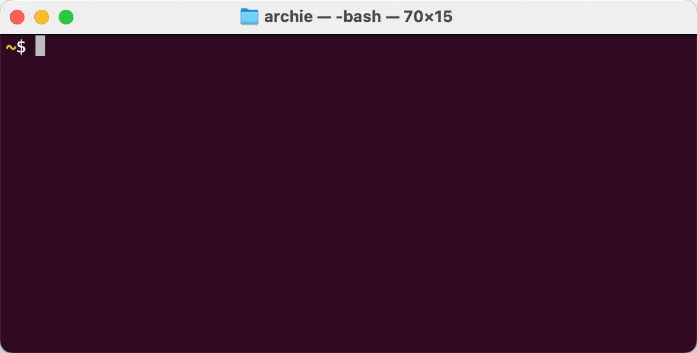

# Plot

A minimalist CLI tool to plot data to the terminal.



- **Data**: From CSV files or command line arguments.
- **Charts**: Currently only bar charts.

## Installation

1. Download the [latest release for your OS](https://github.com/archiewood/plot/releases).
2. Move the binary to a directory in your PATH e.g. `mv plot-darwin-amd64 /usr/local/bin/plot` (May need sudo)
3. Make the binary executable e.g. `chmod +x /usr/local/bin/plot` 
4. Allow the binary to run by adding it to the list of allowed binaries e.g. `xattr -d com.apple.quarantine /usr/local/bin/plot`

### MacOS

```bash
curl -L -o plot https://github.com/archiewood/plot/releases/download/v0.0.1/plot-darwin-amd64
mv plot /usr/local/bin/
chmod +x /usr/local/bin/plot
xattr -d com.apple.quarantine /usr/local/bin/plot
```

## Usage

```bash
plot [-t title] file.csv
plot [-t title] [labels ,]  values
```

### Bar Chart from CSV

```bash
plot test/two_col_header.csv
```

### Bar Chart with Title and Labels

```bash
plot -t "Programming Languages" go python r c++ , 84 950 923 27
```


## Credits

This tool is heavily inspired by [YouPlot](https://github.com/red-data-tools/YouPlot)